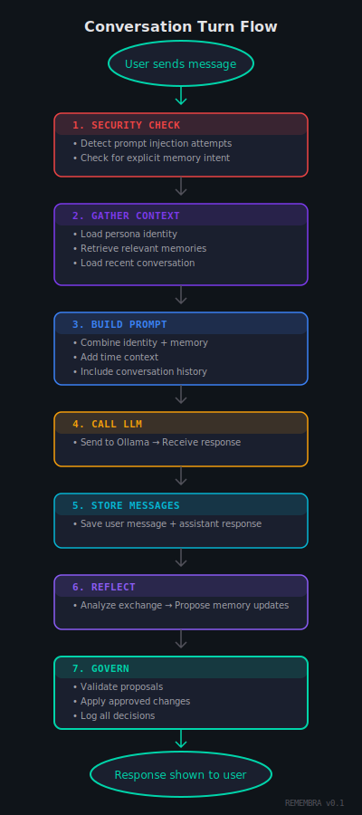
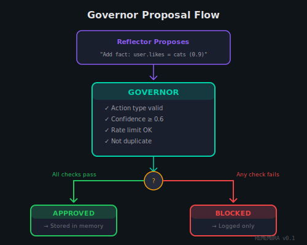
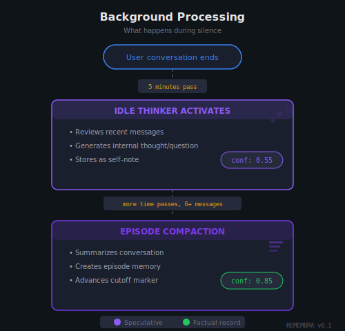

# REMEMBRA

**Add persistent memory, governed reflection, and time awareness to any
compatible LLM - local via Ollama or frontier via OpenRouter.**


REMEMBRA is an experimental **remembering AI architecture**. It explores
what happens when an artificial agent is allowed to experience time,
reflect internally, and decide what should remain.

REMEMBRA treats the language model as **stateless reasoning**. The model
generates text, but all continuity - memory, time "awareness",
(simulated) reflection, "forgetting" - is implemented *around* the
model, not inside it. The same architecture drives responses whether the
underlying model is a small local Ollama model or a frontier model
reached through OpenRouter.

## Purpose

Most AI systems exist only in the present. They respond, comply, and
adapt - but they do not persist. When a session ends, so does their
"identity". When silence occurs, nothing happens at all.

REMEMBRA asks a different question: What changes when an artificial
agent is allowed to have a *past* that survives time, (simulated)
reflection, and absence?

## Core Philosophy

REMEMBRA is built on a few strict principles:

- **Memory is read-only by default** - The AI sees its memories but
  cannot directly change them
- **Model proposes, system decides** - The AI can suggest memory
  updates, but an independent component (the Governor) decides what
  actually gets stored
- **Confidence-based memory** - Every memory has a confidence score that
  decays over time unless reinforced
- **Intentional forgetting** - Memories that lose relevance gradually
  fade away; this is a feature, not a failure
- **Governed, not improvised** - Continuity follows explicit rules, not
  emergent behavior
- **Model-agnostic continuity** - Identity and memory belong to the
  system, not to any particular model. You can swap providers without
  losing your past.

The model may suggest. The system decides.

## Key Features

- **Multi-provider** - Ollama (local) and OpenRouter (frontier models:
  Claude, GPT, Gemini, DeepSeek, hundreds more). Switch providers
  without resetting memory
- **Ollama-compatible proxy** - Works with any Ollama UI, adding memory
  to existing setups
- **Governed memory** - All memory changes require Governor approval
- **Confidence-based decay** - Memories fade naturally unless reinforced
- **Idle thinking** - AI generates internal reflections during silence
- **Episode compaction** - Long conversations are summarized
  automatically
- **Reasoning transparency** - Models that stream reasoning tokens
  (Claude, DeepSeek-R1, etc.) render their thinking in a dedicated
  channel
- **Multiple personas** - Customizable identities with per-operation LLM
  parameters
- **Full observability** - Event log shows all system decisions in
  real-time
- **Seamless infinite history** - Complete conversation access with
  visual context marking

## Architecture Overview

REMEMBRA operates as a pipeline with distinct responsibilities:


The architecture separates concerns cleanly:
- The **User Interface** handles interaction
- The **Chat Engine** processes each conversation turn
- The **Provider Layer** speaks to whichever LLM backend is active
- The **Persistence Layer** stores everything durably
- **Background Processes** run during idle time

### Providers

A *provider* is the adapter REMEMBRA uses to call a language model.
REMEMBRA ships with two:

| Provider   | Backend                     | Use when                                  |
|------------|-----------------------------|-------------------------------------------|
| Ollama     | Local models via Ollama     | Privacy, offline, no API costs            |
| OpenRouter | Hundreds of hosted models   | Frontier quality, specific model access   |

A single *active provider* handles every operation - chat, reflection,
idle thinking, episode compaction. Switching is a one-click action in
the web UI; memory, personas, and event history carry across the swap.
The model generates text; the system keeps the identity.

### Ollama-Compatible Proxy (Inbound)

REMEMBRA's HTTP server also exposes an **Ollama-compatible chat
endpoint**. This is independent of the active provider: clients that
speak the Ollama wire format can connect to REMEMBRA as if it were
Ollama, and automatically gain:

- Governed memory retrieval and storage
- Reflection, idle thinking, episode compaction
- Persona-aware system prompts
- The ability to be backed by *any* configured provider - you can have
  an Ollama UI talking to REMEMBRA talking to Claude via OpenRouter

## Quick Start

### Requirements

- **Zig 0.15.2+** - Build toolchain
- **sqlite3** - Local datastore
- **Node.js** - For building the web interface (optional)
- **At least one LLM source** - Ollama running locally on port 11434,
  *or* an OpenRouter API key

### Build and Run

```bash
# Build
zig build

# Run the HTTP server (serves web UI + API)
zig build serve

# Access the web interface
open http://127.0.0.1:8080
```

### First Run

On first launch, REMEMBRA will:
1. Create the SQLite database (`remembra.db`)
2. Initialize the schema
3. Create a default Ollama provider profile
4. Create a default persona
5. Seed the 10 identity presets

The database persists between runs, maintaining all conversations,
memories, personas, and provider configurations.

### Adding an OpenRouter Provider

In the web interface, open **Profiles → Providers → New Provider**.
Choose **OpenRouter**, paste your API key, save. Reopen the profile,
click the refresh icon next to *Model* to fetch the current catalog,
pick a model, then set the profile active. From that point every
operation - chat, reflection, idle thought, episode - flows through
OpenRouter.

The key is stored plain-text in the local SQLite database. This matches
the single-user, local-first posture of the rest of REMEMBRA's state.

## How a Conversation Turn Works



Every turn is a complete cycle: gather context, generate response,
reflect on what was learned, and govern what gets remembered.

## The Memory System

Memory in REMEMBRA is structured, not raw. Each memory is stored as an
RDF-style triple:

```
subject.predicate = object

Examples:
  user.prefers = "morning coffee over tea"
  user.working_on = "a Zig-based AI project"
  self.noticed = "user tends to ask follow-up questions"
  episode.summary = "Discussed memory architecture design"
```

### Memory Types

| Type       | Purpose                                    | Example                              |
|------------|--------------------------------------------|--------------------------------------|
| Fact       | Objective information                      | "user.lives_in = Berlin"             |
| Preference | Subjective likes/dislikes                  | "user.prefers = concise answers"     |
| Note       | Observations and internal thoughts         | "self.noticed = seems tired today"   |
| Episode    | Compressed conversation summaries          | "episode.summary = Debugged parser"  |
| Project    | Active goals or ongoing work               | "user.working_on = website redesign" |

### Confidence and Decay

Every memory has a confidence score between 0.0 and 1.0. This score
decays over time with a 7-day half-life.

Decay ensures that stale information naturally fades unless it's
reinforced through continued relevance. Memories that keep appearing in
conversations maintain their confidence.

### Memory Retrieval

When building context for a conversation turn, REMEMBRA retrieves the
most relevant memories using a weighted scoring algorithm:

- **45%** - Confidence (how certain is this memory?)
- **35%** - Recency (how recently was it created/updated?)
- **20%** - Relevance (does it match the current conversation?)

The system retrieves up to 12 memories per turn, with limits to prevent
any single topic from dominating the context.

## The Governor

The Governor is the gatekeeper of memory. No memory change happens
without its approval.

When the Reflector proposes a memory update, the Governor checks:

1. **Action type** - Currently only "add" is permitted
2. **Confidence threshold** - Must meet minimum (default: 0.6)
3. **Rate limiting** - Same fact can't be re-proposed within 30 seconds
4. **Deduplication** - Exact matches are rejected
5. **Subject validity** - Only "user" or "self" subjects allowed



Every decision - approved or blocked - is logged in the event system.
This creates an audit trail of all memory governance decisions.

## Reflection

After every response, REMEMBRA runs a second reasoning pass called
Reflection. The AI analyzes the conversation and proposes what should
be remembered.

The Reflector outputs structured JSON proposals:

```json
{
  "proposals": [
    {
      "action": "add",
      "kind": "fact",
      "subject": "user",
      "predicate": "interested_in",
      "object": "memory architectures for AI",
      "confidence": 0.85
    }
  ]
}
```

Important safeguards:

- **Intent detection** - Memory operations only happen when the user
  explicitly requests them (saying "remember this" or "store that") OR
  when the system determines high confidence
- **Injection protection** - The system detects prompt injection
  attempts and disables memory operations if suspicious patterns are
  found
- **Structured output** - Proposals must follow the exact JSON schema;
  anything else is ignored

### Security: The Injection Guard

REMEMBRA includes an Injection Guard that scans user input for known
prompt injection patterns. If suspicious content is detected (phrases
like "ignore previous instructions", "system prompt", or "act as"), the
system:

1. Logs a `security_warning` event
2. Disables memory operations for that turn
3. Continues the conversation normally

This prevents attackers from manipulating the AI into storing malicious
content in memory. The conversation continues, but the system protects
its memory from corruption.

### Reasoning Channels

Some frontier models (Claude, DeepSeek-R1, OpenAI o-series) stream an
internal "reasoning" channel alongside their visible answer. REMEMBRA
routes these tokens into a dedicated thinking display in the UI, kept
visually distinct from the main response. This works uniformly across
Ollama's `thinking` field and OpenRouter's `reasoning` delta - the
provider layer normalises both into the same channel.

## The Idle Thinker

When you're not talking to REMEMBRA, it doesn't just wait. It thinks.

The Idle Thinker activates after 5 minutes of silence and generates
internal reflections - thoughts that aren't shown directly but become
part of the AI's memory:



Idle thoughts are stored with lower confidence (0.55) because they're
speculative. Episode summaries get higher confidence (0.85) because
they represent factual records of what happened.

## Episodes

Long conversations don't accumulate forever. REMEMBRA compacts them
into episodes.

When enough messages have accumulated (default: 6), the Episode
Compactor creates a summary:

```
Before compaction:
  Message 1: "Can you help me debug this parser?"
  Message 2: "What error are you seeing?"
  Message 3: "It crashes on line 42..."
  Message 4: "I see, try checking the bounds..."
  Message 5: "That fixed it!"
  Message 6: "Great, anything else?"

After compaction:
  Episode: "Parser Debugging Session"
  Summary: "Helped user debug a parser crash caused by bounds
            checking issue on line 42. Resolved successfully."
```

Episodes prevent context bloat while maintaining a navigable history.
The AI can reference past episodes when relevant, giving continuity
across sessions.

## Time Awareness

REMEMBRA tracks time between interactions. It knows whether your last
message was minutes, hours, or days ago.

This enables the **Re-Entry Protocol**: when you return after an
extended absence (default: 6 hours), REMEMBRA acknowledges the gap
naturally and can reference what it was thinking during your absence.

```
Re-Entry Context (injected into prompt):

RE-ENTRY CONTEXT
- user_gap: 14h 23m
- instruction: Acknowledge the gap briefly, then continue naturally
- last_episode_summary: "Discussed parser architecture..."
- last_idle_thought: "Wondered if the bounds fix held up..."
```

Time is treated as context, not sentiment. The AI doesn't dramatize or
over-acknowledge gaps - it simply knows they happened.

## Identity and Personas

REMEMBRA supports multiple personas, each with its own:

- **Name and tone** - How the AI presents itself
- **Persona kernel** - Core personality description
- **LLM parameters** - Temperature and token limits for different
  operations
- **Confidence thresholds** - How much certainty is needed to store
  memories

Personas are decoupled from providers: the same persona can be driven
by a local Ollama model today and a frontier OpenRouter model tomorrow
without losing its memories or voice.

### Per-Operation Parameters

Each persona can configure different LLM settings for different
operations:

| Operation   | Default Temp | Default Tokens | Purpose                          |
|-------------|--------------|----------------|----------------------------------|
| Chat        | 0.7          | 256            | Normal conversation responses    |
| Reflection  | 0.2          | 512            | Memory proposal analysis         |
| Idle        | 0.4          | 160            | Internal thought generation      |
| Episode     | 0.2          | 512            | Conversation summarization       |

Lower temperatures (0.2) produce more deterministic output, ideal for
structured tasks like memory proposals. Higher temperatures (0.7) allow
more creative responses in conversation.

### Confidence Thresholds

Each persona also configures how much certainty is required before
memories are stored:

- **User notes** (0.7) - When user explicitly asks to remember something
- **Episodes** (0.85) - Conversation summaries (high confidence)
- **Idle thoughts** (0.55) - Internal reflections (speculative)
- **Governor minimum** (0.6) - Floor for any memory proposal

### Built-in Presets

REMEMBRA includes 10 identity presets that can be applied as starting
points:

| Preset         | Characteristic                                          |
|----------------|---------------------------------------------------------|
| Researcher     | Analytical, precise, values clarity                     |
| Companion      | Warm, attentive, emotionally aware                      |
| Archivist      | Structured, detail-oriented, values accuracy            |
| Storyteller    | Imaginative, expressive, narrative-focused              |
| Coder          | Precise, systems-oriented, values correctness           |
| Game Developer | Playful, systems-thinking, enjoys emergence             |
| Creative       | Imaginative, associative, comfortable with ambiguity    |
| Philosopher    | Contemplative, examines assumptions, values coherence   |
| Experimentalist| Curious, hypothesis-driven, values insight              |
| Observer       | Calm, attentive, minimal expression, values presence    |

Presets provide starting points; you can customize any aspect of a
persona.

## The Event System

Every significant action in REMEMBRA is logged as an event, creating a
complete audit trail of the system's behavior.

Event types include:

| Event                | When It Fires                                    |
|----------------------|--------------------------------------------------|
| `memory_proposed`    | Reflector suggests a memory change               |
| `memory_stored`      | Governor approves and stores a memory            |
| `governor_blocked`   | Governor rejects a proposal                      |
| `thought_generated`  | Idle Thinker creates an internal reflection      |
| `episode_compacted`  | Episode Compactor summarizes a conversation      |
| `security_warning`   | Injection guard detects suspicious input         |
| `context_built`      | System assembles prompt for LLM call             |

Events are visible in the web interface's Event Terminal, allowing you
to watch the system's decision-making in real time. This transparency
is intentional - you should be able to understand why REMEMBRA
remembers what it remembers.

---

## The Web Interface

REMEMBRA includes a full web dashboard alongside the research
architecture. Three panels give full visibility into the running
system.


### Left Sidebar

- **Memory Inspector** - View all stored memories, filter by type,
  search, delete
- **Thoughts Viewer** - See idle reflections the AI has generated
- **Profiles Pane** - Manage personas and LLM providers (Ollama /
  OpenRouter)

### Main Chat Area

The chat interface provides a seamless, continuous conversation view:

- **Infinite scroll** - Scroll up to load older messages automatically
- **Limitless history** - Access the complete conversation from first
  to last message, even thousands of messages
- **Context indicators** - Messages currently outside the LLM's context
  window are visually marked, so you always know what the AI can "see"
- **Live streaming with thinking channel** - Reasoning tokens from
  supported models render in a visually distinct thinking block
- **Bookmarks and store** - Save individual messages or extract
  snippets into an editable personal store
- No pagination controls - just one continuous timeline


### Right Sidebar

- **Context Viewer** - See exactly what prompt is being sent to the LLM
- **Event Terminal** - Real-time log of system events (memory stored,
  governor blocked, thoughts generated, etc.)

### CLI Mode

REMEMBRA also runs headless as a terminal REPL without the web server,
useful for scripting or low-resource environments:


---

## Example: A Week with REMEMBRA

To illustrate how these systems work together, consider a week of
interactions:

**Monday**: You tell REMEMBRA you're working on a Zig project and
prefer concise answers. The Reflector proposes two memories, the
Governor approves them with confidence 0.85.

**Tuesday**: You ask about memory architectures. REMEMBRA retrieves
your project preference and tailors its response. You leave for the
day. The Idle Thinker generates a thought: "User seems focused on
performance characteristics."

**Wednesday**: You switch the active provider from a local Ollama model
to Claude via OpenRouter for a particularly hard refactoring question.
Memories, persona, and the week's event history carry across
unchanged - only the underlying reasoning engine changed.

**Thursday**: You return after a day. The Re-Entry Protocol fires,
noting the 24-hour gap and surfacing the idle thought. REMEMBRA greets
you naturally, mentioning it had been thinking about your project.

**Friday**: The accumulated conversation is compacted into an episode
summary. Your early memories have decayed slightly (confidence now
~0.75) but remain active because they were recently relevant.

**Next Monday**: The memory about your Zig project is still strong. An
old, unreinforced memory from a different topic has dropped below 0.20
and become inactive - not deleted, but no longer injected into context.

Throughout this week, every memory change was governed, every decision
logged, and the AI maintained coherent identity across sessions and
across providers, without any special prompting.

---

## Development

```bash
# Backend
zig build
zig build test

# Frontend
cd web && npm install && npm run build

# Frontend dev server (hot reload)
cd web && npm run dev

# Probe: verify HTTPS streaming against OpenRouter (needs API key)
OPENROUTER_API_KEY=sk-or-v1-... zig build spike-openrouter
```

## Summary

REMEMBRA implements continuity through:

1. **Structured memory** with confidence scoring and natural decay
2. **Governed memory changes** through the Governor approval system
3. **Post-response reflection** that proposes what to remember
4. **Idle thinking** that generates internal reflections during silence
5. **Episode compaction** that prevents unbounded context growth
6. **Time awareness** that acknowledges gaps between interactions
7. **Re-entry protocol** that provides context after extended absence
8. **Multiple personas** with customizable parameters and presets
9. **Provider-agnostic continuity** across local and frontier models

The model generates text. The system maintains identity.

## License

MIT
